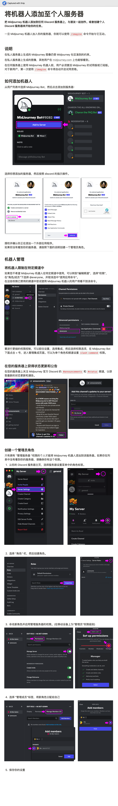

# Midjourney

## Prompts 相关

- [MJ Prompt 生成器](https://yesu.tech/)：直接输入你想画的内容，就能生成 Mid 所需的 Prompts
- [prompthero](https://prompthero.com/): 适用于 ChatGPT、Midjourney、Stable Diffusion，最近用 Midjourney 比较多，找见想要风格的图片，直接复制 Prompts 就可以，效果还是不错的
- [https://lib.kalos.art/](https://lib.kalos.art/)：AI 艺术风格库
- [MidJourney-Styles-and-Keywords-Reference](https://github.com/willwulfken/MidJourney-Styles-and-Keywords-Reference): MidJourney 关键词手册，里面列出了非常多的关键词和对应 MidJourney 画出来的效果
- [MidJourney Prompt Helper](https://prompt.noonshot.com/midjourney): MidJourney 提示助手

## Midjourney 平替网站

- [Yodayo](https://yodayo.com/text-to-image/)：一键出图，操作更简单！制作 60 张图片
- [Kalos](https://kalos.art)：支持 Midjourney V4 和 Stable Diffusion，一键复制 prompt，实用又方便

## Midjourney 入门教程

- [Midjourney AI 绘画：从入门到精通系列课](https://www.bilibili.com/video/BV1p24y1h7CQ)
- [Midjourney 学习导航](https://learningprompt.wiki/docs/midjourney-learning-path)

## 术语库

- https://lib.kalos.art/ ：AIGC 艺术家样式库 lib.KALOS.art 。一个 4 人小团队前后忙了 4 周。目前全球规模最大，1300+艺术家共 3 万余张 4v1 样式图片，覆盖三个主流图像生成模型，为每个艺术家都生成了 8~11 种常见主题，如 人像、风景、科幻、街景、动物、花卉等主题
- 术语库收集：[https://mp.weixin.qq.com/s/DFHAXp192VsvyH5TRDRL6Q](https://mp.weixin.qq.com/s/DFHAXp192VsvyH5TRDRL6Q)
- Google 艺术与文化：[https://artsandculture.google.com/explore](https://artsandculture.google.com/explore)
- Master List of Photographers Midjourney v4：[https://docs.google.com/spreadsheets/d/1fFgHH_kUhu-TTR8aRxnzJScDaUA8WYbRejLjD19NhM0/edit#gid=2051206720](https://docs.google.com/spreadsheets/d/1fFgHH_kUhu-TTR8aRxnzJScDaUA8WYbRejLjD19NhM0/edit#gid=2051206720)
- feed 社区：[https://www.midjourney.com/showcase/recent/](https://www.midjourney.com/showcase/recent/)
- 生成人像的网站：[https://huggingface.co/spaces/aipicasso/picasso-diffusion-latest-demo](https://huggingface.co/spaces/aipicasso/picasso-diffusion-latest-demo)

- AIGC 资料合集：[https://checker-duke-d51.notion.site/23b9463f9ad540e1bed6b927e06131b4?v=c121b5677f6d4344918eed8fe4b7e30a](https://www.notion.so/23b9463f9ad540e1bed6b927e06131b4)
- 一个专业的 Midjourney Prompt 工具站：[https://prompt.noonshot.com/](https://prompt.noonshot.com/)
- [https://prompthero.com/](https://prompthero.com/)
- AI 分析图片，给出相对接近的 Prompt：
  pharmapsychotic/clip-interrogator – Run with an API on Replicate
  [https://replicate.com/pharmapsychotic/clip-interrogator](https://replicate.com/pharmapsychotic/clip-interrogator)
- [https://github.com/willwulfken/MidJourney-Styles-and-Keywords-Reference](https://github.com/willwulfken/MidJourney-Styles-and-Keywords-Reference)
- 优化 prompts：[https://promptperfect.jina.ai/](https://promptperfect.jina.ai/)

## 案例分享

- [做一个英文绘本](https://twitter.com/mranti/status/1639445923737763840?s=12&t=Ijr1EQS4lpR7ko3D2ZXinQ)

## 其他

将机器人添加到个人服务器

